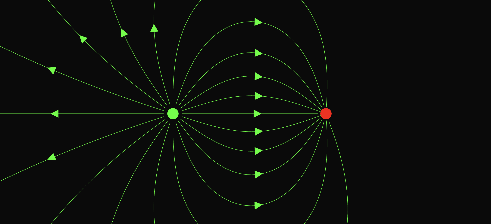

# electric field visualizer

## introduction

This is a mini-project built to combine the discussion of electric field lines and computer graphics. Given the position of charged particles in the plane, we can draw lines indicating the direction of the electric field at various points in the plane.
This tool is simply a cool way to visualize these field lines in space.

## usage

Click anywhere on the plane to add a charge. Click on any charge to adjust the value of the charge. Click and slowly drag the charge around the plane to adjust the charge's position.

## notes

Note that the concept of an "infinity" source of charge does not exist here. A positive charge must exist on the plane for lines to be drawn, which is contrary to how electric fields are conventionally drawn. This is a key detail that has not been implemented in this version.
Additionally, bear in mind that the more and more charges that exist on the plane, the slower the field lines will take to compute and redraw.

## how it works

A number of points (determined by the magnitude of the charge) are drawn on the surface of a charge. Then the direction of the total electric field is computed at that point, and a new point is chosen in that direction at a pre-determined offset (resolution).
This continues until a point is chosen that is outside the screen's bounds, or that is in a terminating (negative) charge. These points are then interpolated using a spline curve and an arrow is drawn indicating the direction of the field line.